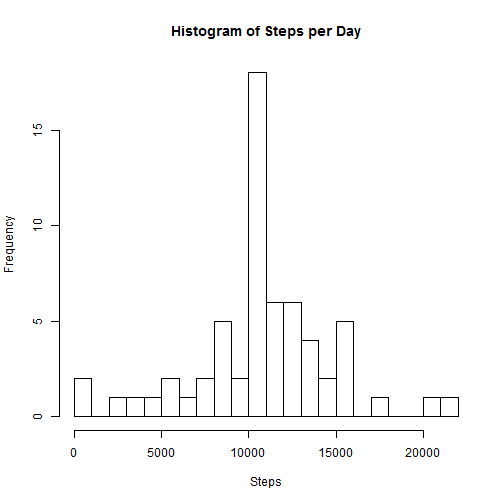

*This R markdown document will provide answers to several questions being asked about recorded steps taken during October and November, 2012.*

### SECTION 1 - Load and pre-process the data

This section will load libraries, download the appropriate data from the web (if necessary), unzip the file to the selected working directory, and load it to a table.

```r
# Load libraries
library(data.table)
```

```
## data.table 1.9.6  For help type ?data.table or https://github.com/Rdatatable/data.table/wiki
```

```
## The fastest way to learn (by data.table authors): https://www.datacamp.com/courses/data-analysis-the-data-table-way
```

```r
library(ggplot2)

# Set working directory
setwd("C:\\Users\\Warren\\Desktop\\Coursework\\Coursera\\Reproducible Research\\Week 2 Assignment\\")

if (file.exists("activity_data.zip")) {
  # Unzip to working directory and load CSV file into R
  unzip(zipfile = "activity_data.zip")
  activity <- data.table(read.csv(file = "activity.csv"))
} else {
# Download activity data from the web, unzip to working directory, then load into R
  download.file(url = "https://d396qusza40orc.cloudfront.net/repdata%2Fdata%2Factivity.zip",
                destfile = "activity_data.zip")
  unzip(zipfile = "activity_data.zip")
  activity <- data.table(read.csv(file = "activity.csv"))
}
```

### SECTION 2 - What is the mean total number of steps taken per day?

The first part of this section will create and output a histogram of the
number of steps taken.  Missing values are left as missing.

```r
# Take the sum of the number of steps for each day. When creating this calculation
#   missing values will return "NA".
activity_sum <- activity[, .(steps = sum(steps, na.rm = FALSE)),
                         by = .(date)]

# Create a barplot
#   a). stat = "identity": the bars heights will represent values in the data
#   b). vjust will adjust the all tick marks in x-axis to align with bars
#   c). Errors that come up are acceptable as NA values will be plotted
g <- ggplot(data = activity_sum, mapping = aes(x = date, y = steps))
g + geom_bar(stat = "identity") +
  theme(axis.text.x = element_text(angle=90, size = 8, vjust = .5)) +
  ggtitle("Number of Steps Taken per Day During Oct-Nov, 2012") +
  labs(x = "Date", y = "Total Steps Taken")
```

```
## Warning: Removed 8 rows containing missing values (position_stack).
```


This section will output the mean and the median number of steps, ignoring
the effect of missing values.

```r
# Calculate the mean and median of the number of steps each day. If a specific
#   day returned a missing value for the total number of steps, then that date
#   would not contribute in any way the mean and median calculations below.
activity_mean_median <- activity_sum[,.(mean = mean(steps, na.rm = TRUE),
                                        median = median(steps, na.rm = TRUE))]

# Print mean
activity_mean_median$mean
```

```
## [1] 10766.19
```

```r
# Print median
activity_mean_median$median
```

```
## [1] 10765
```
### SECTION 3 - What is the average daily activity pattern?

This section will create a plot of average steps per interval across all
days and output the interval with the most number of steps.

```r
# Take an average of each 5 minute interval across all days.
activity_interval <- activity[,.(steps = mean(steps, na.rm = TRUE)),
                                 by = .(interval)]

# Creates a time series that plots the average steps across each 5-minute interval
#   averaged across all Nov-Dec, 2012 days.
plot(x=activity_interval$interval, y=activity_interval$steps,
     type="l",
     xlab="5-Minute Interval",
     ylab="Steps",
     main="Avg Steps per 5-Minute Interval")
```


```r
# Identify the 5-minute interval that contains the highest average number of
#   steps across all Oct-Nov, 2012 dates.
activity_interval_max <- activity_interval[order(activity_interval$steps, decreasing = TRUE),]

# Print result
activity_interval_max[1,]$interval
```

```
## [1] 835
```

### SECTION 4 - Impute missing values

This section will impute values where missing values exist.  The imputed values
will be the average of the 5-minute interval across all days, ignoring
the missing values themselves.  In addition, the updated mean and median values,
including the newly imputed values, will be shown here.

```r
# Calculate the number of missing values in the dataset.
activity_count_NA <- activity[,.(NACount = sum(is.na(steps)))]

# The mean number of steps for each 5-minute interval across all Oct-Nov, 2012 days
#   will be used to fill in missing values.
activity_mean <- activity[,.(steps_mean = mean(steps, na.rm = TRUE)),
                              by = .(interval)]

# Impute the interval means in for missing values ("NA").
activity_imp <- merge(x = activity, y = activity_mean, by = c("interval"))
activity_imp$steps <- ifelse(is.na(activity_imp$steps),
                                   activity_imp$steps_mean,
                                   activity_imp$steps)

# Create daily step sums from new dataset and create a histogram of the total
#   number of steps taken each day.
activity_sum2 <- activity_imp[, .(steps = sum(steps, na.rm = FALSE)),
                          by = .(date)]

g <- ggplot(data = activity_sum2, mapping = aes(x = date, y = steps))
g + geom_bar(stat = "identity") +
  theme(axis.text.x = element_text(angle=90, size = 10, vjust = .5)) +
  ggtitle("Number of Steps Taken per Day During Oct-Nov, 2012") +
  labs(x = "Date", y = "Total Steps Taken")
```



```r
# Calculate the mean and median of the number of steps each day using the new
#   datasets.
activity_mean_median2 <- activity_sum2[,.(mean = mean(steps),
                                        median = median(steps))]

# Print mean
activity_mean_median2$mean
```

```
## [1] 10766.19
```

```r
# Print median
activity_mean_median2$median
```

```
## [1] 10766.19
```

### SECTION 5 - Are there differences in activity patterns between weekdays and weekends?

This section will create a panel plot that highlights the difference between
weekday and weekend step activity.

```r
# Using the imputed dataset, create a new factor variable that identifies "weekday" and
#   "weekend".
activity_imp$date <- as.Date(x = activity_imp$date, "%Y-%m-%d")
activity_imp$day <- weekdays(x = activity_imp$date, abbreviate = TRUE)
activity_imp$daytype <- as.factor(ifelse(activity_imp$day == "Sat" | activity_imp$day == "Sun",
                               "weekend",
                               "weekday"))

# Take an average of each 5 minute interval across all days.
activity_interval2 <- activity_imp[,.(steps = mean(steps, na.rm = TRUE)),
                              by = .(interval, daytype)]

# Make a panel plot containing a time series plot of the 5-minute
#   interval (x-axis) and the average number of steps taken, averaged across all
#   weekday days or weekend days (y-axis).
ggplot(data = activity_interval2, aes(x = interval, y = steps)) +
  geom_line(stat = "identity") + facet_grid(daytype~.) +
  ggtitle("Avg. Steps Taken per 5-Minute Interval - Weekday vs. Weekend") +
  labs(x = "Interval", y = "Steps")
```


